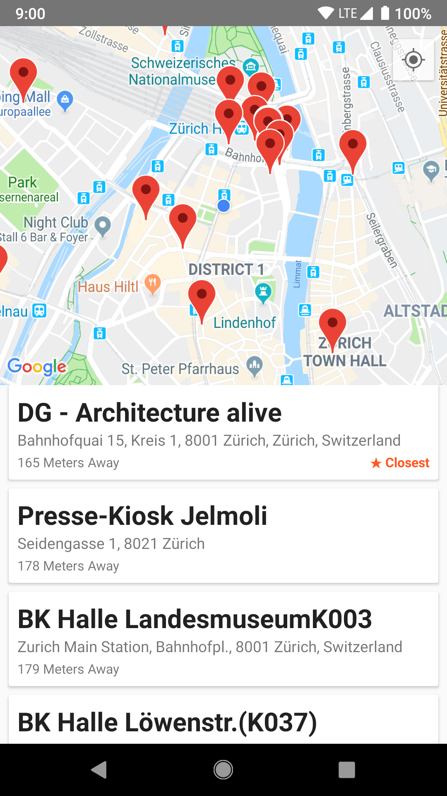

# ATM Locator

An app which shows a list of Swiss ATMs closest to the users' location

## Description

The app contains two fragments, a Map Fragment and a custom fragment housing the RecyclerView.

The model layer is connected to the view layer through a View Model (MVVM). A series of tests are written for the Repository, but could be expanded to encompass the entire app.

Some edge cases are covered (user rejects location, network not found, etc.) but there are many which are not. A few examples are if the location moves, or if the network is regained under a session. Given more time, these would be relatively trivial to implement.	

## Built With

* [Kotlin](https://kotlinlang.org/)
* [Lifecycle](https://developer.android.com/topic/libraries/architecture/lifecycle)
* [LiveData](https://developer.android.com/topic/libraries/architecture/livedata)
* [ViewModel](https://developer.android.com/topic/libraries/architecture/viewmodel)
* [Mockito](https://site.mockito.org/)
* [RecyclerView](https://developer.android.com/reference/android/support/v7/widget/RecyclerView)
* [Retrofit](https://square.github.io/retrofit/)
* [Room](https://developer.android.com/topic/libraries/architecture/room)
* [Android Design Support Library](https://developer.android.com/topic/libraries/support-library/packages)
* [ConstraintLayout](https://developer.android.com/reference/android/support/constraint/ConstraintLayout)
* [Koin](https://github.com/InsertKoinIO/koin)
* [Mockito-Kotlin](https://github.com/nhaarman/mockito-kotlin/wiki)

## License

 

Copyright (C) 2018 Boris Kachscovsky

This program is free software: you can redistribute it and/or modify it under the terms of the GNU General Public License as published by the Free Software Foundation, either version 3 of the License, or (at your option) any later version.

This program is distributed in the hope that it will be useful, but WITHOUT ANY WARRANTY; without even the implied warranty of MERCHANTABILITY or FITNESS FOR A PARTICULAR PURPOSE. See the GNU General Public License for more details. You should have received a copy of the GNU General Public License along with this program. If not, see http://www.gnu.org/licenses/.